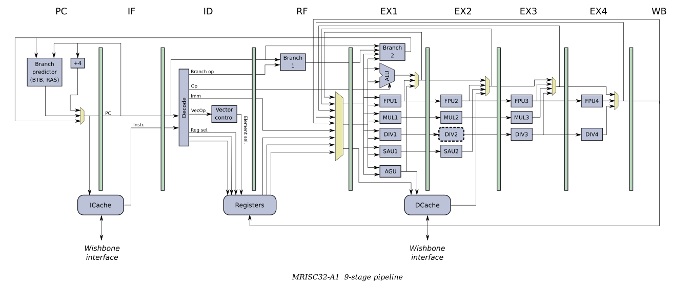

# MRISC32-A1

This is a [VHDL](https://en.wikipedia.org/wiki/VHDL) implementation of a single issue, in-order CPU that implements the [MRISC32](https://github.com/mrisc32/mrisc32) ISA. The working name for the CPU is *MRISC32-A1*.

## Overview

## Progress

The CPU is nearing completion but still under development. The following components have been implemented:

* A 9-stage pipeline.
  - PC and branching logic.
  - Instruction fetch.
  - Decode.
  - Register fetch.
  - Execute.
  - Data read/write logic (scalar and vector).
  - Register write-back.
  - Operand forwarding.
* The integer ALU.
  - Supports all packed and unpacked integer ALU operations.
  - All ALU operations finish in one cycle.
* A pipelined (three-cycle) integer multiply unit.
  - Supports all packed and unpacked integer multiplication operations.
* A semi-pipelined integer and floating point division unit.
  - The integer division pipeline is 3 stages long, while the floating point division pipeline is 4 stages long.
  - 32-bit division: 15/12 cycles stall (integer/float).
  - 2 x 16-bit division: 7/5 cycles stall (integer/float).
  - 4 x 8-bit division: 3/2 cycles stall (integer/float).
* A pipelined (two-cycle) Saturating Arithmetic Unit (SAU).
  - Supports all packed and unpacked saturating and halving arithmetic instructions.
* An IEEE 754 compliant(ish) FPU.
  - The following single-cycle FPU instructions are implemented:
    - FMIN, FMAX
    - FSEQ, FSNE, FSLT, FSLE, FSUNORD, FSORD
  - The following three-cycle FPU instructions are implemented:
    - ITOF, UTOF, FTOI, FTOU, FTOIR, FTOUR
  - The following four-cycle FPU instructions are implemented:
    - FADD, FSUB, FMUL
  - Both packed and unpacked FPU operations are implemented.
* The scalar register file.
  - There are three read ports and one write port.
* The vector register file.
  - There are two read ports and one write port.
  - Each vector register has 16 elements (configurable).
* An address generation unit (AGU).
  - The AGU supports all addressing modes.
* Branch prediction and correction.
  - A direct mapped 2-bit dynamic branch predictor (512 entries, configurable).
  - A return address stack predictor (16 entries, configurable).
  - The branch misprediction penalty is 3 cycles (a correctly predicted branch incurs no penalty).
* A direct mapped instruction cache.
* Two 32-bit Wishbone (B4 pipelined) interfaces to the memory.
  - Instruction and data requests have separate Wishbone interfaces.
  - One memory request can be completed every cycle per interface.

**TODO**: Data cache, interrupt logic.

## Configurability

The aim is for the MRISC32-A1 to implement the complete MRISC32 ISA, which means that it is a fairly large design (including an FPU, hardware multiplication and division, packed operations, etc).

If the design is too large or complex for a certain target chip (FPGA), it is possible to disable many features via `T_CORE_CONFIG` (see [config.vhd](rtl/common/config.vhd)). E.g. setting `HAS_MUL` to `false` will disable support for hardware multiplication.

It is also possible to change the vector register size by chaging the value of `C_LOG2_VEC_REG_ELEMENTS` (4 means 16 elements, 5 means 32 elements, 8 means 256 elements, and so on).

## Performance

The MRISC32-A1 can issue **one operation per clock cycle**.

When synthesized against an [Intel Cyclone V FPGA](https://www.intel.com/content/www/us/en/products/programmable/fpga/cyclone-v.html), the maximum running frequency is close to **100 MHz**.

